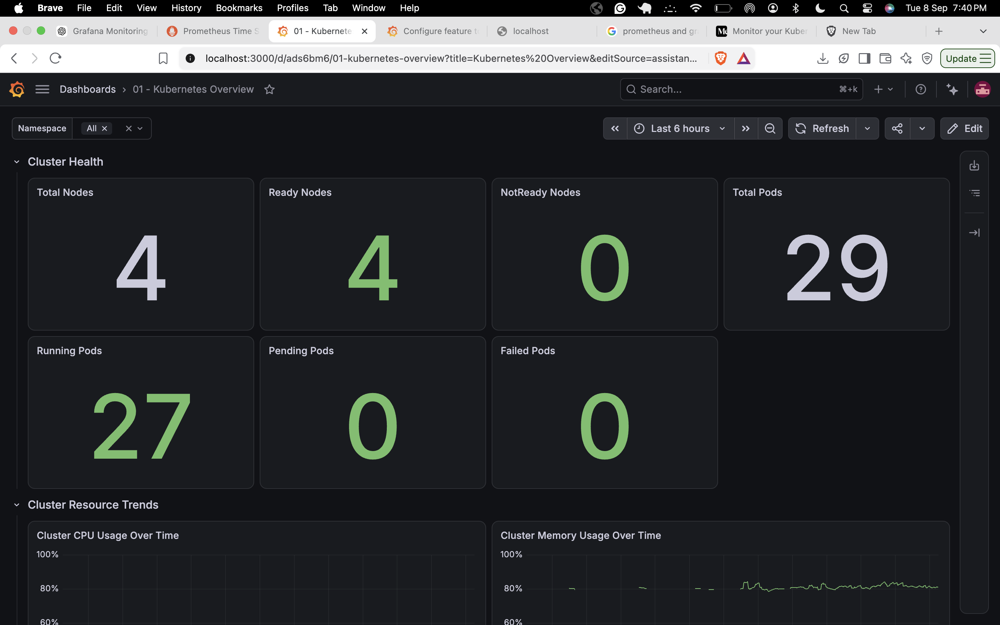
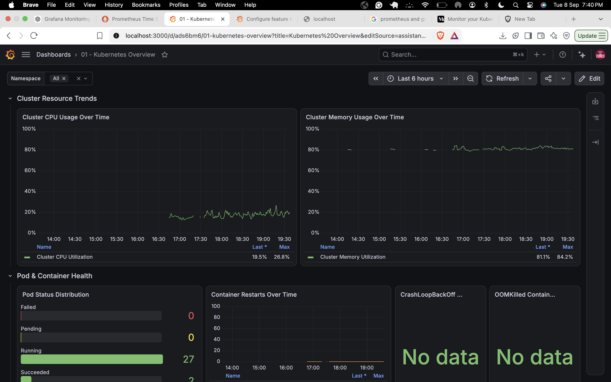
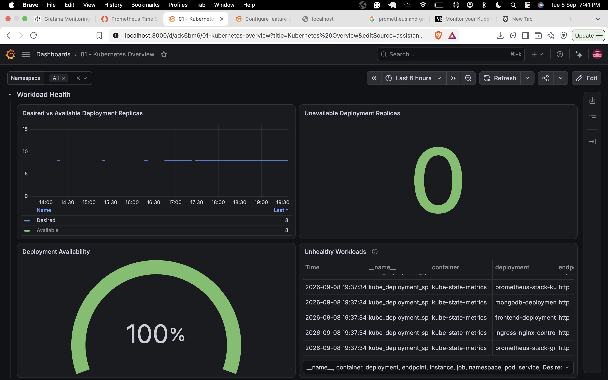
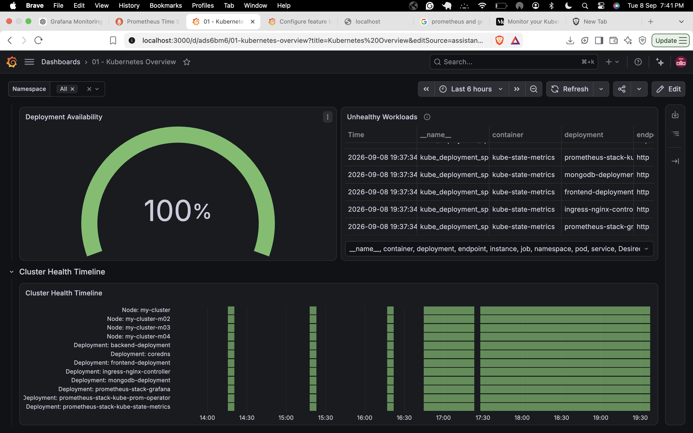
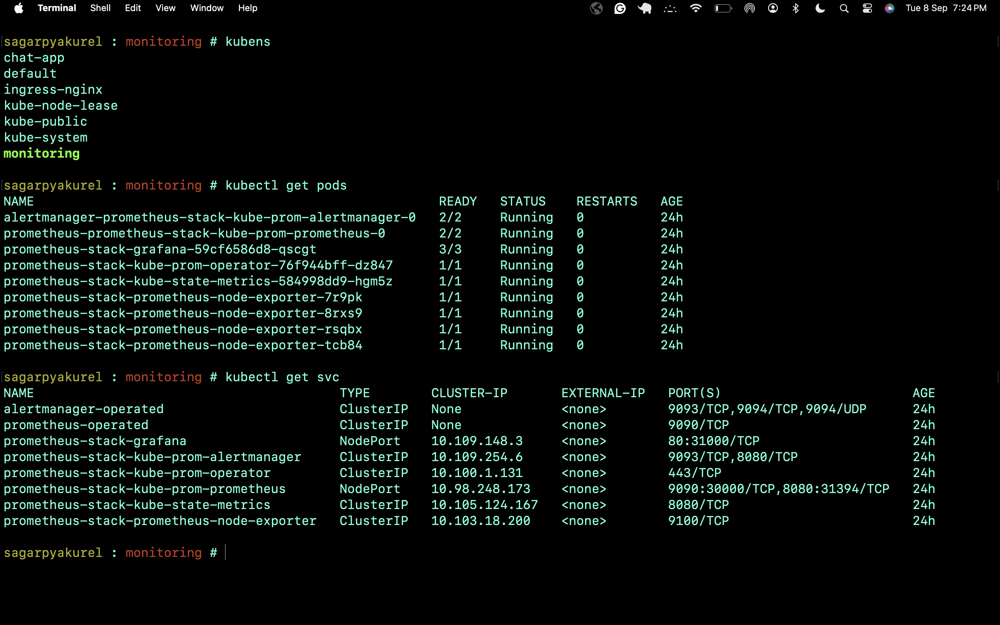

# Kubernetes Prometheus Grafana Monitoring

A complete monitoring solution for Kubernetes clusters using Prometheus for metrics collection and Grafana for visualization.

---

## 📖 Documentation

**[View Full Documentation](./Documentation.pdf)** - Complete setup guide, configuration details, and troubleshooting steps.

---

## 🎨 Grafana Dashboards

### Dashboard 1

### Dashboard 2

### Dashboard 3

### Dashboard 4

### Dashboard 5

---

## 📚 Full Documentation

For detailed information about setup, configuration, deployment, and troubleshooting, please refer to the complete documentation:

**[📖 Open Full Documentation (PDF)](./Documentation.pdf)**

---

## ✨ Features

- **Prometheus**: Metrics collection and alerting
- **Grafana**: Beautiful dashboards and visualization
- **Kubernetes Integration**: Native K8s monitoring
- **Custom Dashboards**: Pre-configured dashboard templates
- **Alerting**: Built-in alerting capabilities

---

## 🚀 Quick Start

For complete setup instructions, refer to the [Full Documentation](./Documentation.pdf).

---

## 📝 License

This project is provided as-is for monitoring and observability purposes.

---

**For more information, please check the [Full Documentation](./Documentation.pdf)**
